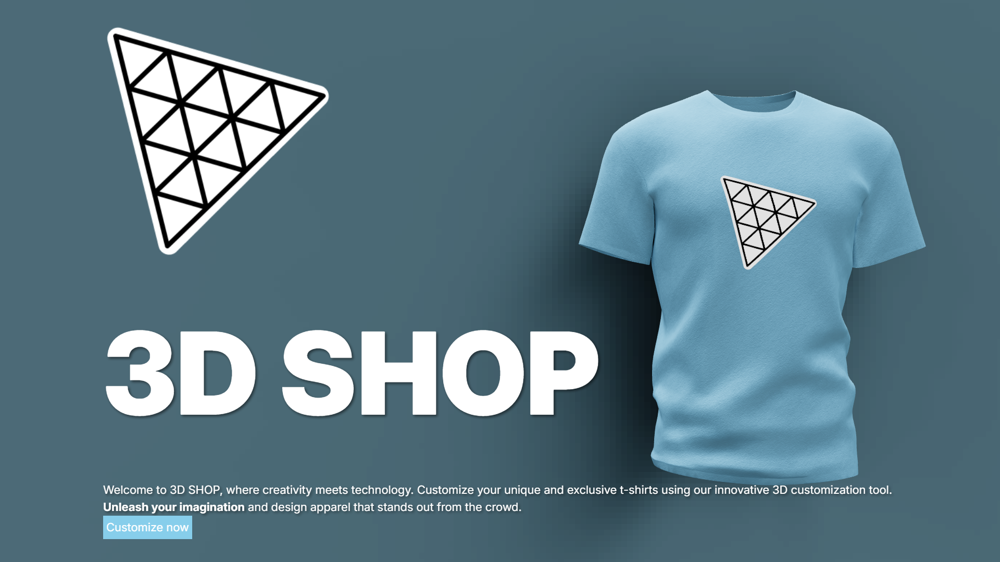
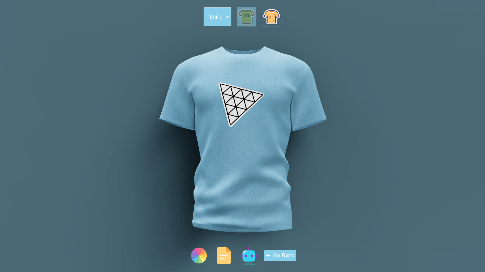
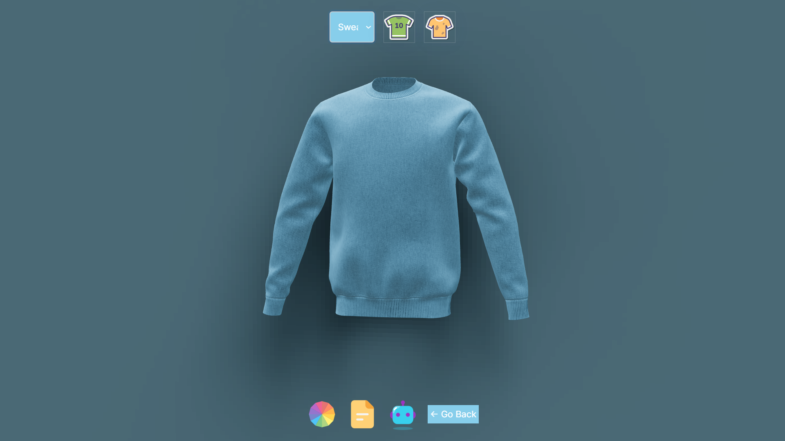
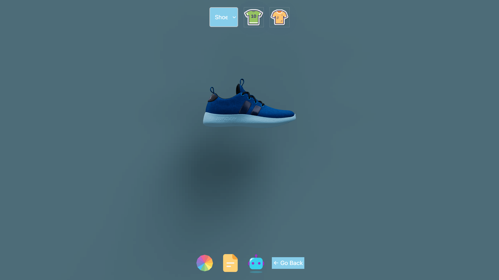
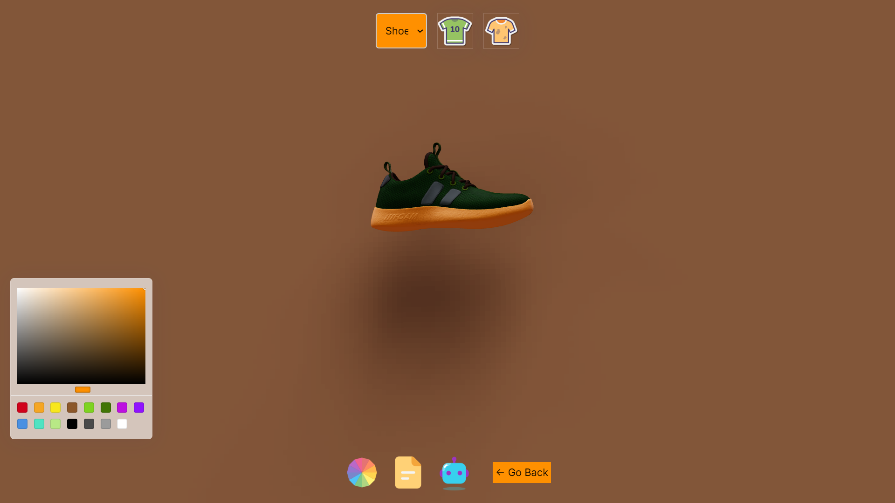
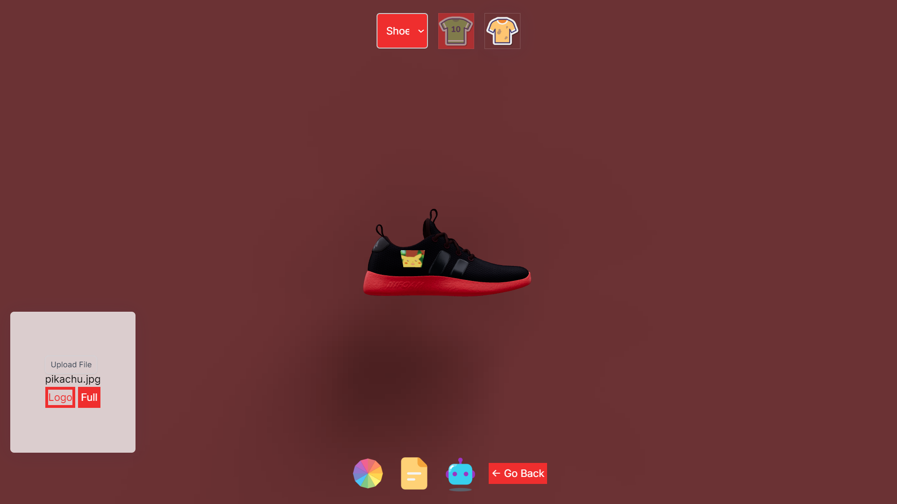

<h2 align="center">3D AI Store</h2>
 
View, design and customize the color and logo of the clothing items in a 3D environment built by using React.js, Three.js, Node.js and OpenAI API

### Features

- Create unique combinations of colors using the color picker
- Upload a file or generate a file using AI for using as a logo, or even for an overall texture!

## Screenshots
**Home Page**


**Customization Page**
- Shirt Model


- Sweat Shirt Model


- Shoe Model


**Color Picker**


**Logo Picker**


### Installation guide

**Clone the Repository**

```bash
git clone https://github.com/its-me-abhishek/3D_AI_Store.git
cd 3d_AI_Store
```

**Set Up the frontend**

```bash
cd client
npm install
```

**Set Up the backend**

```bash
cd server
npm install
```

**Set Up Environment Variables**

Create a new file named `.env` in the root of your project and add the following content:

```env
OPENAI_API_KEY="YOUR_OPEN_AI_KEY"
```

Replace the placeholder value with your actual OpenAI key. You can obtain these by signing up on the [Open website](https://openai.com/).

**Running the Project**

1. Server
   ```bash
   npm start
   ```
2. Client
   ```bash
   npm run dev
   ```

Open [http://localhost:5173](http://localhost:5173) in your browser to view the project.
